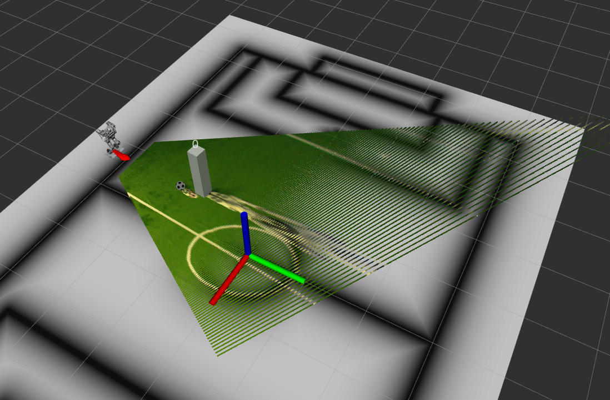

.. _SoccerIPM:

Soccer IPM
##########

Overview
========

Soccer IPM is a ROS package that provides a node to project 2D image space detections of soccer related objects (e.g., balls, goal posts, robots, etc.) to 3D space. 
The node uses the camera calibration parameters as well as the forward kinematics of the robot to perform the projection.
It is assumed that all objects are on the ground plane.
The input detections are expected to be in the form of `soccer_vision_2d_msgs <https://github.com/ros-sports/soccer_interfaces/tree/rolling/soccer_vision_2d_msgs/msg>`_ messages.
The projected detections are published in the form of `soccer_vision_3d_msgs <https://github.com/ros-sports/soccer_interfaces/tree/rolling/soccer_vision_3d_msgs/msg>`_ messages as defined in the `soccer_interfaces <https://github.com/ros-sports/soccer_interfaces>`_.

You need to provide it also with some parameters such as the ball diameter, output frame, etc..

Subscriptions
-------------

- ``camera_info``: Subscribes to camera info.
- ``balls_in_image``: Subscribes to ball detections in image space. 
- ``goal_posts_in_image``: Subscribes to goal post detections in image space.
- ``robots_in_image``: Subscribes to robot detections in image space.
- ``obstacles_in_image``: Subscribes to obstacle detections in image space.
- ``field_boundary_in_image``: Subscribes to the detected field boundary in image space. 
- ``markings_in_image``: Subscribes to line marking detections in image space.
- ``tf``: Subscribes to tf updates.
- ``tf_static``: Subscribes to tf static information.

Publications
------------

- ``balls_relative``: Publishes the detected balls in the given output frame.
- ``goal_posts_relative``: Publishes the detected goalposts in the given output frame.
- ``robots_relative``: Publishes the detected robots in the given output frame.
- ``obstacles_relative``: Publishes the detected obstacles in the given output frame.
- ``field_boundary_relative``: Publishes the detected field boundary in the given output frame.
- ``markings_relative``: Publishes the detected line markings in the given output frame.

How do I use it?
================

First of all, you need to download the repo as well as its dependencies and build the package in your workspace.
You can do this by running the following commands:

.. code-block:: bash

   git clone https://github.com/ros-sports/soccer_ipm.git src/soccer_ipm
   rosdep install --from-paths src --ignore-src -r -y
   colcon build

Now you can source the workspace again to make the package available in your environment:

.. code-block:: bash

   source install/setup.bash

To launch the Soccer IPM node, you can use the following command (note that you need to provide the path to the config file described below):

.. code-block:: bash

   ros2 run soccer_ipm soccer_ipm --ros-args --params-file <path_to_params_file>

You probably want to do this using a launch file. For example, you can use the following launch and config files:

.. code-block:: xml

   <node pkg="soccer_ipm" exec="ipm" name="soccer_ipm" output="screen">
      <param from="$(find-pkg-share your_package)/config/soccer_ipm.yaml" />
   </node>

.. code-block:: yaml
   :caption: soccer_ipm.yaml
  
   soccer_ipm:
    ros__parameters:
      balls:
        ball_diameter: 0.153

      goalposts:
        footpoint_out_of_image_threshold: 0.8
        object_default_dimensions:
          x: 0.1
          y: 0.1
          z: 1.0

      obstacles:
        footpoint_out_of_image_threshold: 0.8
        object_default_dimensions:
          x: 0.2
          y: 0.2
          z: 1.0

      robots:
        footpoint_out_of_image_threshold: 0.8
        object_default_dimensions:
          x: 0.2
          y: 0.2
          z: 1.0

      output_frame: 'base_footprint'
      use_distortion: False

The `soccer_ipm.yaml` config file contains the parameters of our node. 
They mainly include the ball diameter (the ball projection is performed on an elevated plane for less error due to object depth), 
the output frame (the frame in which the output is published), 
and the default dimensions of the objects.
They also include the ``footpoint_out_of_image_threshold`` parameter which is used to determine whether the footpoint of an object is out of the image or not.
Objects with a footpoint below this fraction of the image height are considered to be out of the image.
If the real footpoint of an object is not visible, it is ignored as using the lowest point of the object as its footpoint will result in a wrong projection.
The ``use_distortion`` parameter is used to determine whether to use the distortion parameters from the camera info or not. Don't use them if you detect the objects in an already rectified image.

Visualization
=============

You can use the `soccer-vision-3d-rviz-markers <https://soccer-vision-3d-rviz-markers.readthedocs.io>`_ package to visualize the projected detections.

This launch file can be used to adjust the topic names and ball diameter to match the setup from the previous section:

.. code-block:: xml

   <launch>
      <node pkg="soccer_vision_3d_rviz_markers" exec="visualizer" name="soccer_vision_3d_rviz_marker_visualizer" output="screen">
            <remap to="/field_boundary_relative" from="soccer_vision_3d/field_boundary"/>
            <remap to="/balls_relative" from="soccer_vision_3d/balls"/>
            <remap to="/goal_posts_relative" from="soccer_vision_3d/goalposts"/>
            <remap to="/robots_relative" from="soccer_vision_3d/robots"/>
            <remap to="/obstacles_relative" from="soccer_vision_3d/obstacles"/>
            <remap to="/markings_relative" from="soccer_vision_3d/markings"/>
            <param name="ball_diameter" value="0.153"/>
        </node>
   </launch>

The resulting visualization could look like this (note that this image also shows a visualization of the :ref:`IPM Image Node`, which not only projects the detections but also the image itself to the world space).
You can see the ball as well as the robot detections on the field.

|
