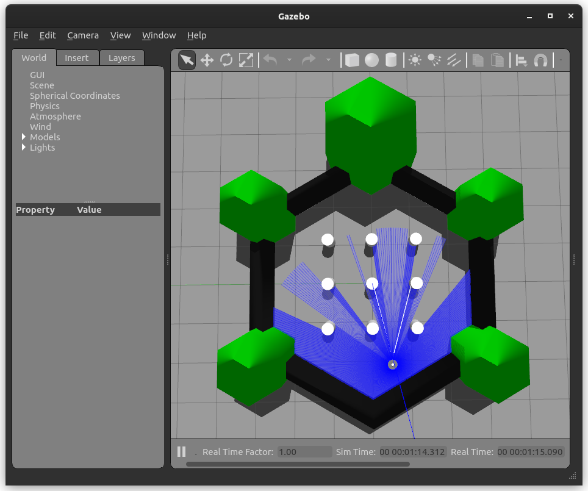
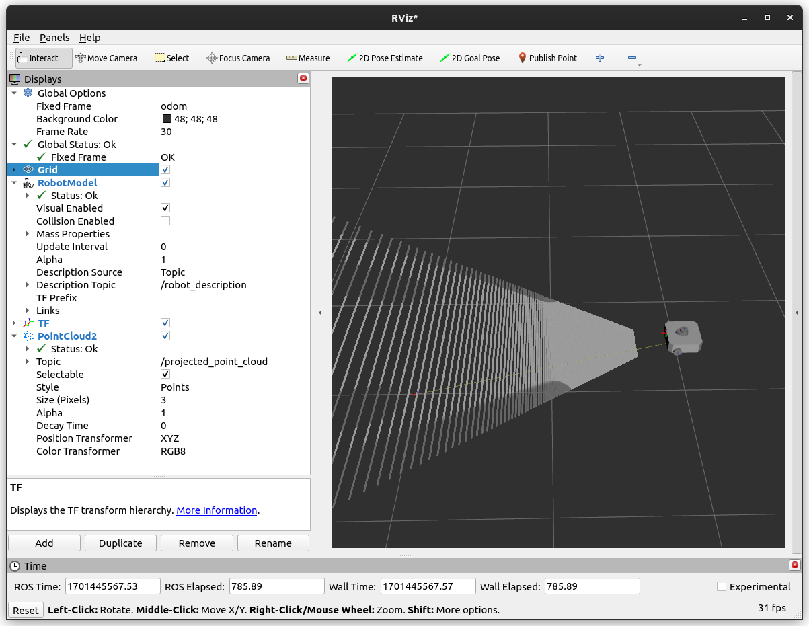
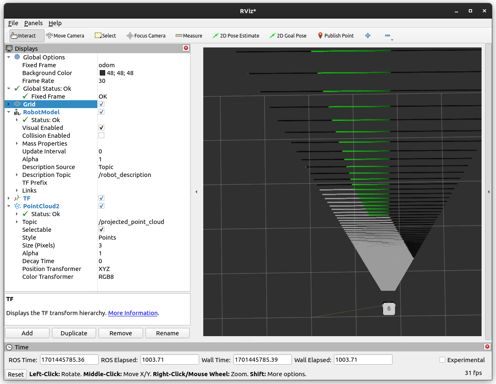
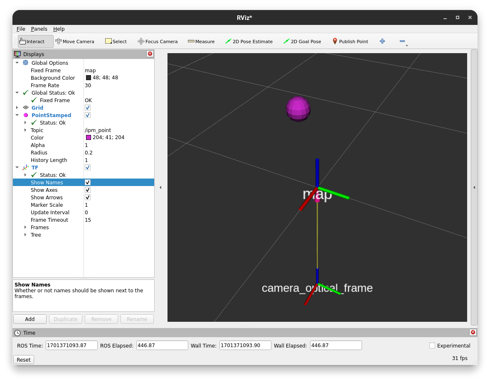
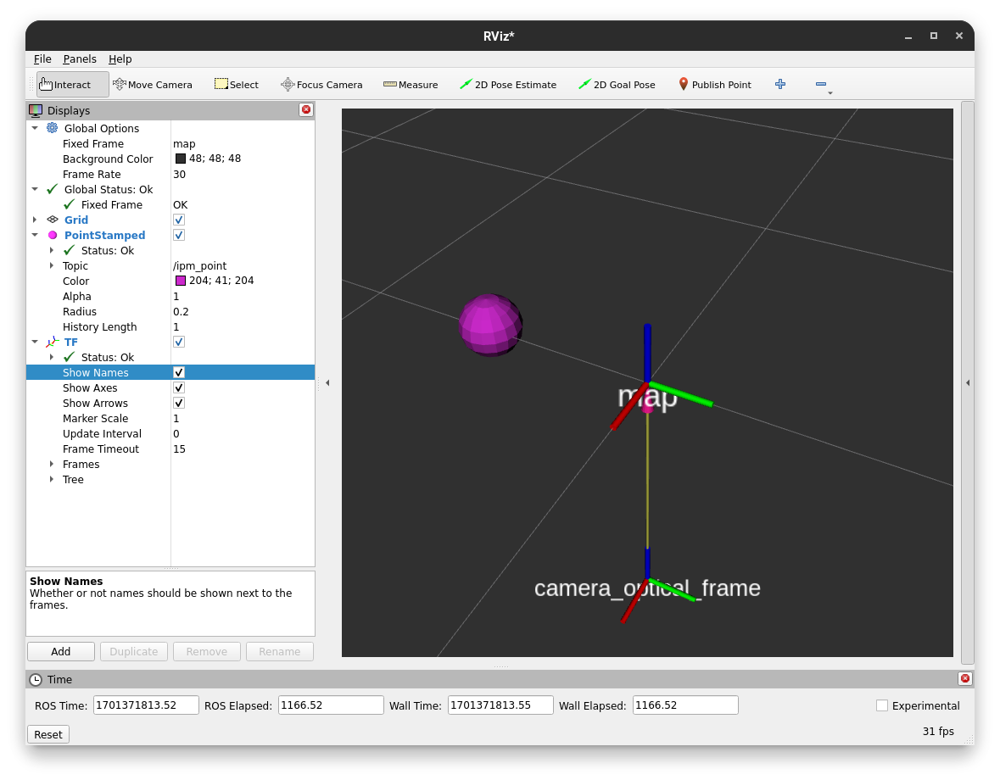
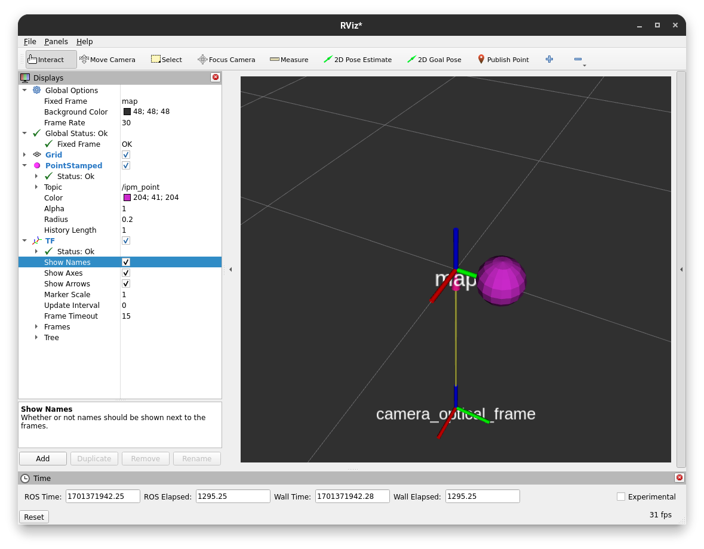
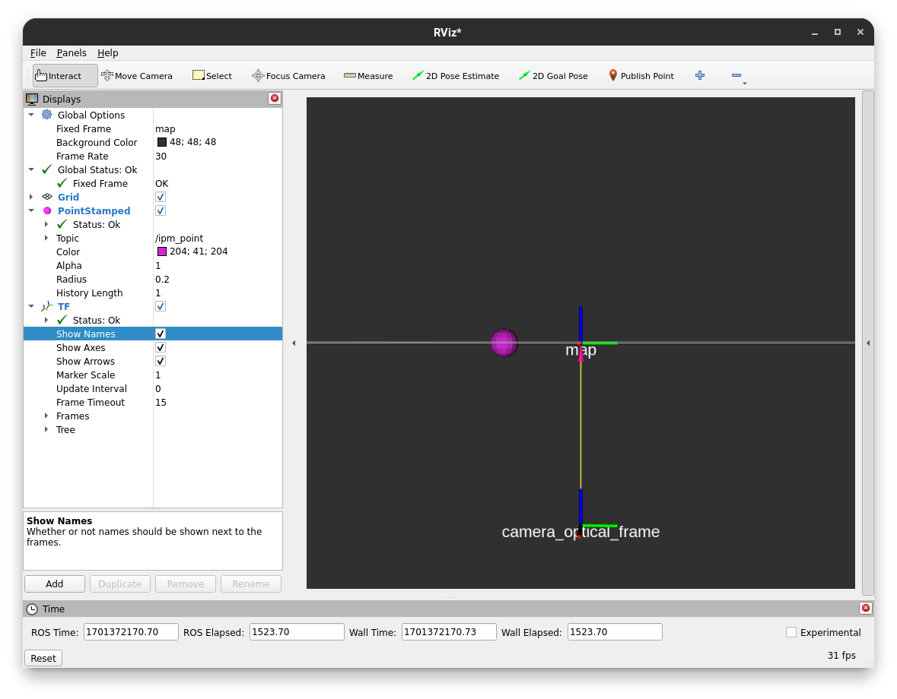
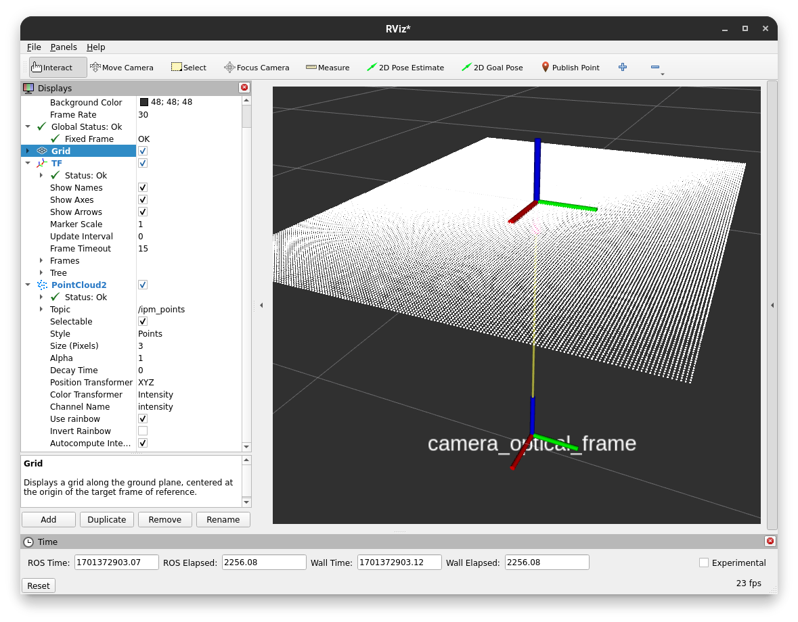
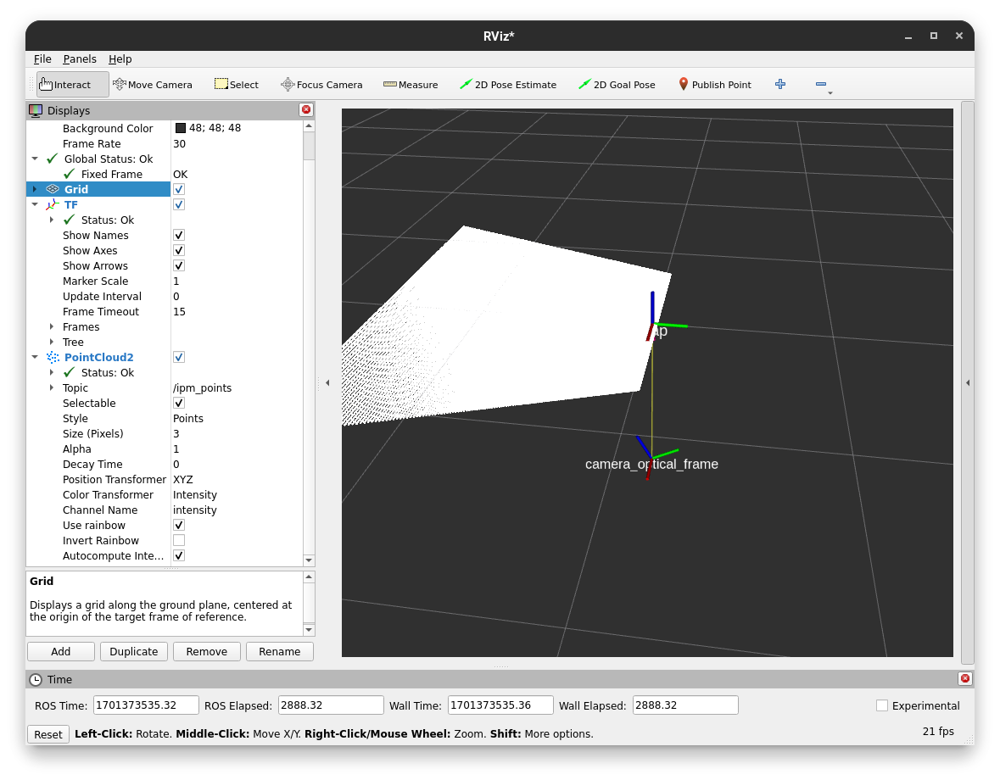
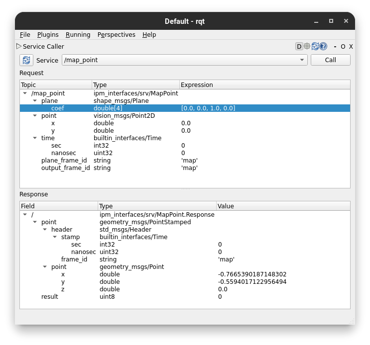

.. _Tutorial:

Tutorial
########

The IPM repo features multiple components. The main ones are:

* The :ref:`IPM Library`, which is a vectorized implementation of the IPM projection. It exposes a Python API, that can be used directly.
* The :ref:`IPM Service`, which wraps the IPM library in a ROS 2 service. It can be used perform language agnostic IPM projections using normal ROS interfacing.
* The :ref:`IPM Image Node`, which can be used to directly project images (e.g. from a camera) or masks onto a given plane. It essentially listens to a image topic, related camera info and TF to publish a point cloud containing the projected pixels.

.. _IPM Image Node:

IPM Image Node
==============

The IPM image node is a ROS 2 node that can be used to directly project images (e.g. from a camera) or masks onto a given plane. 
It is the most user friendly way to use the IPM projection and is the recommended way to use the IPM projection in many cases.

The :ref:`IPM Library` and the :ref:`IPM Service` are more flexible and can be used to project points in a more general way.
They are e.g. used for the `Soccer IPM <https://github.com/ros-sports/soccer_ipm>`_ node, which projects `soccer_vision_2d_msgs <https://github.com/ros-sports/soccer_interfaces/tree/rolling/soccer_vision_2d_msgs/msg>`_ from the `soccer_interfaces <https://github.com/ros-sports/soccer_interfaces>`_ package onto the ground plane.

In this tutorial we will use the IPM image node to project a full image onto the ground plane. 
To do this in a more or less realistic way, we will use the `turtlebot3` simulation in Gazebo.
It will be assumed that you have a working ROS 2 installation and performed the steps in :ref:`Installation`.
Also don't forget to source your ROS 2 installation as well as the IPM workspace.

First of all we need to install the `turtlebot3-gazebo` ROS 2 package.

.. code-block:: bash

    sudo apt install ros-$ROS_DISTRO-turtlebot3-gazebo

In addition to that we need to clone the `turtlebot3` ROS 2 packages from GitHub into our colcon workspace source directory (e.g. `~/colcon_ws/src`).

.. code-block:: bash

    git clone git@github.com:ROBOTIS-GIT/turtlebot3.git 

Now we can build our workspace using the following command:

.. code-block:: bash

    colcon build

After that we need to source our workspace so we know about the new packages.

.. code-block:: bash

    source install/setup.bash

Then we can launch the simulation using the following command:

.. code-block:: bash

    TURTLEBOT3_MODEL=waffle_pi ros2 launch turtlebot3_gazebo turtlebot3_world.launch.py

You should see the following view in Gazebo:

|

Now we can launch the IPM image node using the following command. 
Note that we are remapping topics to be compliant with the turtlebot3 simulation topic names.
We also set two parameters to define the output frame and the type of the input image.
The projection of full rgb images is not very common except for visualization purposes, but it is a good way to test the IPM image node.
Normally one would e.g. project only the non zero points of a mask segmenting e.g. road markings onto the ground. 
This can be done by setting the `type` parameter to `mask`. 
To increase performance, one can also set the `scale` parameter to a value smaller than 1. 
This results in fewer points being projected and thus less computation time.

.. code-block:: bash

    ros2 run ipm_image_node ipm --ros-args \
        -r camera_info:=/camera/camera_info \
        -r input:=/camera/image_raw \
        -p type:=rgb_image \
        -p output_frame:=odom

You can add the following xml to a launch file to launch the IPM image node.

.. code-block:: xml

    <launch>
        <node pkg="ipm_image_node" type="ipm" name="ipm_image_node" output="screen">
            <remap from="camera_info" to="/camera/camera_info"/>
            <remap from="input" to="/camera/image_raw"/>
            <param name="type" value="rgb_image"/>
            <param name="output_frame" value="odom"/>
        </node>
    </launch>

Now we can open RViz2 and add the point cloud display to visualize the result on topic `/projected_point_cloud`. 
For better visibility you can set the style to `Points`. 
You also want to set the Fixed Frame to `odom` to see the result in the correct frame.
Adding the robot model as well as the TF display can also be helpful to see the spatial relationship between the robot and the projection plane.

You should see the following view in RViz:

|

You can now move the robot around in Gazebo and see the projection change in RViz. 
Note that the projection is only useful for things close to the ground plane.
To move the robot around you can use the following command:

.. code-block:: bash

    ros2 run turtlebot3_teleop teleop_keyboard

You could see the following view in RViz after moving the robot around:

|

.. _IPM Library:

IPM Library
===========

In this part of the tutorial, we will learn how to use the IPM library directly.
We will write a small Python script that will project a list of points onto a given plane.
It will be assumed that you have a working ROS 2 installation and performed the steps in :ref:`Installation`.
Also don't forget to source your ROS 2 installation as well as the IPM workspace.

First of all we manually publish a tf frame that shows the spatial relationship between our camera and the plane we want to project onto.
In a real world scenario, this would be already present in the tf tree of your robot setup, but for this toy example we will publish it manually.

.. code-block:: bash

    ros2 run tf2_ros static_transform_publisher 0 0 -1 0 0 0 1 map camera_optical_frame

Project a single point
----------------------

Now we can write our Python script (`ipm_example.py`), where we will project given pixels onto the plane.
Please read the comments in the code understand what is needed for the projection and where one needs to be careful.

.. code-block:: python

    import rclpy
    import tf2_ros as tf2
    from builtin_interfaces.msg import Time
    from geometry_msgs.msg import PointStamped
    from ipm_library.exceptions import NoIntersectionError
    from ipm_library.ipm import IPM
    from rclpy.node import Node
    from sensor_msgs.msg import CameraInfo
    from shape_msgs.msg import Plane
    from std_msgs.msg import Header
    from vision_msgs.msg import Point2D

    class IPMExample(Node):
        def __init__(self):
            # Let's initialize our node
            super().__init__('ipm_example')

            # We will need to provide the cameras intrinsic parameters to perform the projection
            # In a real scenario, this would be provided by the camera driver on a topic
            # If you don't know the intrinsic parameters of your camera,
            # you can use the camera_calibration ROS package to calibrate your camera
            self.camera_info = CameraInfo(
                header=Header(
                    # This defines where the camera is located on the robot
                    frame_id='camera_optical_frame',
                ),
                width=2048,
                height=1536,
                k=[1338.64532, 0., 1026.12387, 0., 1337.89746, 748.42213, 0., 0., 1.])

            # We want to publish the projected points on a topic so we can visualize them in RViz
            self.point_pub = self.create_publisher(PointStamped, 'ipm_point', 10)

            # A TF buffer is needed as we need to know the spatial relationship between the camera and the plane
            self.tf_buffer = tf2.Buffer()
            self.tf_listener = tf2.TransformListener(self.tf_buffer, self, spin_thread=True)

            # Initialize the IPM library with a reference to the forward kinematics of the robot
            # We also need to provide the camera info, this is optional during the initialization
            # as it can be provided via a setter later on as well
            self.ipm = IPM(self.tf_buffer, self.camera_info)

            # We will now define the plane we want to project onto
            # The plane is define by a normal and a distance to the origin
            # following the plane equation ax + by + cz + d = 0
            self.plane = Plane()
            self.plane.coef[2] = 1.0  # Normal in z direction

        def main(self):
            while rclpy.ok():
                # We will ask the user for a pixel to project
                point = Point2D(
                    x = float(input('Enter pixel x: ')),
                    y = float(input('Enter pixel y: '))
                )

                # Use latest time for TF
                # Note that this is not the correct way to do this, but it is sufficient for this example
                # Normally, you would use the timestamp of the image/meassurement you want to project
                # This is relevant as the tf tree is time dependent and might change over time as the robot moves
                # This can lead to wrong projections, especially close to the horizon where the projection is very sensitive
                time = Time()

                # We will now project the pixel onto the plane using our library
                try:
                    point = self.ipm.map_point(
                        self.plane,
                        point,
                        time,
                        plane_frame_id='map', # We defined a transform from the map to the camera earlier
                        output_frame_id='map' # We want the output to be in the same frame as the plane
                    )

                    # Print the result
                    print(f'Projected point: {point.point.x}, {point.point.y}, {point.point.z}')

                    # Now we will publish the projected point on a topic so we can visualize it in RViz
                    self.point_pub.publish(point)
                except NoIntersectionError:
                    print('No intersection found')

    if __name__ == '__main__':
        rclpy.init()
        ipm_example = IPMExample()
        ipm_example.main()
        rclpy.shutdown()

.. warning::

   Don't use this snipped for large numbers of points. To project many points (like all pixels in an image) use the following snipped, which utilizes NumPy and calls e.g. TF only once for all of them.

Now that we have our script, we can run it using the following command:

.. code-block:: bash

    python3 ipm_example.py

In a proper ROS environment one would put this into a ROS package, declare all dependencies and run it using the ROS 2 launch system.
We skip this for now for simplicity of this tutorial.

It will ask you for a pixel to project and then publish the projected point on the topic `ipm_point`.

You can e.g. enter the pixel (0, 0) and view the result in RViz by adding a PointStamped display and setting the topic to `ipm_point`.
You can also add the TF display to see the relationship between the camera and the planes origin.

To run RViz, use the following command:

.. code-block:: bash

    rviz2

After entering the pixel (0, 0) you should see this result in RViz. You can interpret this as the camera looking from the bottom along the z axis onto the map plane which has z as it's normal vector.

As the cameras transform is currently aligned to the world coordinates (i.e. the map), we can enter a pixel with a higher x position value and see the point moving along the red x axis to the bottom left.
This is not always the case, as the camera can be rotated in any direction, but the simple transform we defined earlier enables this sanity check.

The same is true for the y axis, but the point will move along the green y axis.

If you align the camera with the plane (so you look edge on), you can see that the point will not move in the z direction.

Project a large number of points at once
----------------------------------------

We can adapt the script from earlier to efficiently project a number of points at once.
In this case a NumPy array instead of the Point2D ROS message is used as our input data structure.

.. code-block:: python

    import numpy as np
    import rclpy
    import tf2_ros as tf2
    import time
    from builtin_interfaces.msg import Time
    from ipm_library.ipm import IPM
    from rclpy.node import Node
    from sensor_msgs_py.point_cloud2 import create_cloud_xyz32
    from sensor_msgs.msg import CameraInfo, PointCloud2
    from shape_msgs.msg import Plane
    from std_msgs.msg import Header

    class IPMExample(Node):
        def __init__(self):
            # Let's initialize our node
            super().__init__('ipm_example')

            # We will need to provide the cameras intrinsic parameters to perform the projection
            # In a real scenario, this would be provided by the camera driver on a topic
            # If you don't know the intrinsic parameters of your camera,
            # you can use the camera_calibration ROS package to calibrate your camera
            self.camera_info = CameraInfo(
                header=Header(
                    # This defines where the camera is located on the robot
                    frame_id='camera_optical_frame',
                ),
                width=2048,
                height=1536,
                k=[1338.64532, 0., 1026.12387, 0., 1337.89746, 748.42213, 0., 0., 1.])

            # We want to publish the projected points on a topic so we can visualize them in RViz
            self.point_cloud_pub = self.create_publisher(PointCloud2, 'ipm_points', 10)

            # A TF buffer is needed as we need to know the spatial relationship between the camera and the plane
            self.tf_buffer = tf2.Buffer()
            self.tf_listener = tf2.TransformListener(self.tf_buffer, self, spin_thread=True)

            # Initialize the IPM library with a reference to the forward kinematics of the robot
            # We also need to provide the camera info, this is optional during the initialization
            # as it can be provided via a setter later on as well
            self.ipm = IPM(self.tf_buffer, self.camera_info)

            # We will now define the plane we want to project onto
            # The plane is define by a normal and a distance to the origin
            # following the plane equation ax + by + cz + d = 0
            self.plane = Plane()
            self.plane.coef[2] = 1.0  # Normal in z direction

        def main(self):
            while rclpy.ok():
                # Get all pixels coordinates in the image as an NumPy array
                # Due to RViz getting laggy with too many points, we will only use every 10th pixel
                points = np.meshgrid(np.arange(0, self.camera_info.width, 10), np.arange(0, self.camera_info.height, 10))
                points = np.stack(points, axis=-1).reshape(-1, 2)

                # Use latest time for TF
                # Note that this is not the correct way to do this, but it is sufficient for this example
                # Normally, you would use the timestamp of the image/measurement you want to project
                # This is relevant as the tf tree is time dependent and might change over time as the robot moves
                # This can lead to wrong projections, especially close to the horizon where the projection is very sensitive
                measurement_time = Time()

                # We will now project the pixel onto the plane using our library
                header, mapped_points = self.ipm.map_points(
                    self.plane,
                    points,
                    measurement_time,
                    plane_frame_id='map', # We defined a transform from the map to the camera earlier
                    output_frame_id='map' # We want the output to be in the same frame as the plane
                )

                # Convert the NumPy array into a point cloud message so we can publish it for visualization
                point_cloud = create_cloud_xyz32(header, mapped_points)

                # Now we will publish the projected points on a topic so we can visualize them in RViz
                self.point_cloud_pub.publish(point_cloud)

                # Sleep a bit
                time.sleep(0.1)

    if __name__ == '__main__':
        rclpy.init()
        ipm_example = IPMExample()
        ipm_example.main()
        rclpy.shutdown()

After running this script, you can visualize the result in RViz by adding a PointCloud2 display and setting the topic to `ipm_points`.
You can also set the style to `Points` for better visibility.

The visualization should look similar to this:

While we project most of our field of view onto the plane, we can see the effects of camera rotations of the projected points.
We can adjust our camera transform to see the effects of rotations more clearly.
After replacing the dummy transform publisher with the following one, a slight camera rotation along the x axis is performed.

.. code-block:: bash

    ros2 run tf2_ros static_transform_publisher 0 0 -1 0.25 0 0 0.97 map camera_optical_frame

Here are the effects on the projection:

Now you should know the basics of the IPM library and how to use it to project points onto a plane using the Python API.
In the following sections we will learn how to use the IPM service and the IPM image node, which are more tightly integrated into the ROS ecosystem and provide a simpler out of the box experience respectively.

.. _IPM Service:

IPM Service
===========

While the service adds more overhead it enables a tighter integration into the ROS ecosystem and enables compatibility with e.g. C++ code.
It also only keeps one TF buffer in case multiple nodes want to share this component.

To launch the IPM service simply run:

.. code-block:: bash

    ros2 run ipm_service ipm_service

The IPM Service will now listen to the `/camera_info` topic (you can remap this if you have multiple cameras or another camera namespace) and provide two services.
One service for projecting single Point2D points and another to project point clouds in an efficient manner.

As we are currently in a dummy setup we publish the camera info manually by running the following command:

.. code-block:: bash

    ros2 topic pub /camera_info sensor_msgs/msg/CameraInfo "header:
      stamp:
       sec: 0
       nanosec: 0
      frame_id: 'camera_optical_frame'
    height: 1536
    width: 2048
    distortion_model: 'pinhole'
    k:
      - 1338.64532
      - 0.0
      - 1026.12387
      - 0.0
      - 1337.89746
      - 748.42213
      - 0.0
      - 0.0
      - 1.0"

We also need a transform from the camera to the plane. For now we do a simple dummy static transform. Later on this will be dynamically provided by the tf tree connecting the camera frame with the projection plane (e.g. the ground).

.. code-block:: bash

    ros2 run tf2_ros static_transform_publisher 0 0 -1 0 0 0 1 map camera_optical_frame

Now we can open `rqt` and load the Service Caller plugin (`Plugins > Services > Service Caller`).
This way we are able to test the service without writing any scripts.
Later on the service is obviously called in your code, but for now we keep using the gui.

After selecting the `/map_point` service you should see the following view. Enter the values accordingly.
For now you can use a 0 time to use the latest transform available.
Note that this is a bad idea in most real world applications and you want to use the time stamp of your measurement (e.g. image) instead.

You should get a response with the same values compared to calling the Python API directly with the script in :ref:`IPM Library`.
The service definitions are from the `ipm_interfaces` in the IPM repo.
Look there if you get any non zero results.

The IPM service also provides a fast way to project many points at once without resulting in too many service calls.
You can use the `/map_points` service, which accepts a point cloud as input.